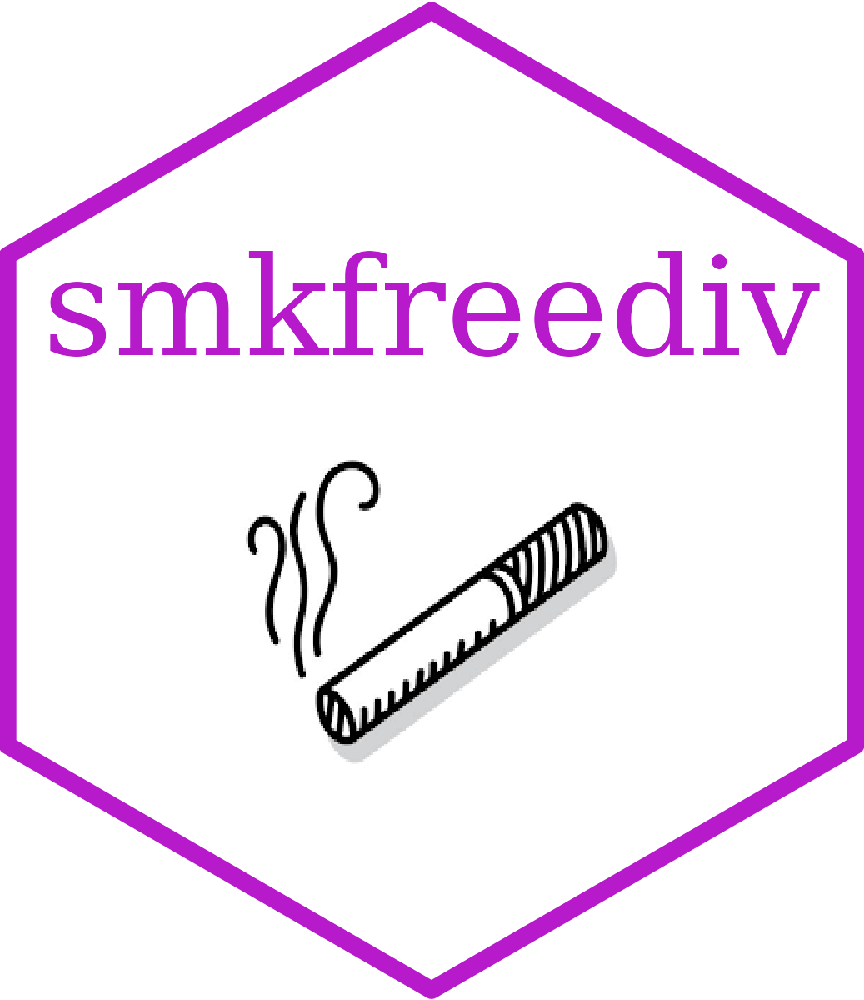

<!-- README.md is generated from README.Rmd. Please edit that file -->

```{r, include = FALSE}
knitr::opts_chunk$set(
  collapse = TRUE,
  comment = "#>",
  fig.path = "man/figures/README-",
  out.width = "100%"
)
```

# Calculating the Smoke-free Dividend for England 

<!-- badges: start -->

[](https://www.repostatus.org/#active) [](https://www.tidyverse.org/lifecycle/#stable) [](https://doi.org/10.17605/OSF.IO/R5VKU)

<!-- badges: end -->

## The Sheffield Tobacco and Alcohol Policy Modelling Platform

This R package was developed as part of the Sheffield Tobacco and Alcohol Policy Modelling <https://stapm.gitlab.io/> by the [Sheffield Centre for Health and Related Research (SCHARR) at the University of Sheffield](https://www.sheffield.ac.uk/scharr).

The aim of the research programme is to identify and evaluate approaches to reducing the harm from tobacco and alcohol, with the aim of improving commissioning in a public health policy context, i.e. providing knowledge to support benefits achieved by policymakers.

## Motivation for developing the R package

The motivation for `smkfreediv` was to produce reusable functions and data for the calculation of the smoke-free dividend for England. This package is used along with the code repository [on the STAPM GitHub](https://github.com/STAPM/smoke-free-dividend) [@morris2023] to produce the estimates reported in the paper "The potential smoke-free dividend across local areas in England: A cross-sectional analysis". [citation needed when published]

## Purpose of making the code open source

The code has been made open source for the following two reasons:

-   Transparency. Open science, allowing review and feedback to the project team on the code and methods used.
-   Methodology sharing. For people to understand the code and methods used so they might use aspects of it in their own work, e.g., because they are doing something partially related that isn't exactly the same job and might like to 'dip into' elements of this code for inspiration.

## Citation

Morris D, Gillespie D, Dockrell M, Cook M, Horton M, Brown J, Langley T ([YEAR]). smkfreediv: An R package for calculating the smoke-free dividend for England. R package version [x.x.x]. University of Sheffield. <https://github.com/STAPM/smkfreediv>. doi: <https://doi.org/10.17605/OSF.IO/R5VKU>

## Installation

`hseclean` is publicly available via Github.

By default the user should install the latest tagged version of the package. Otherwise, if you want to reproduce project work and know the version of the package used, install that version.

If on a University of Sheffield managed computer, install the R, RStudio and Rtools bundle from the Software Centre. Install Rtools - using the [installr](https://cran.r-project.org/web/packages/installr/index.html) package can make this easier. Then install the latest or a specified version of `smkfreediv` from Github with:

```{r gh_installation, message=FALSE, eval = FALSE}
#install.packages("devtools")

devtools::install_git(
  "https://github.com/stapm/smkfreediv.git", 
  ref = "x.x.x",
  build_vignettes = FALSE)

# ref = "x.x.x" is the version to install - change to the version you want e.g. "1.2.3", or delete this line 
# to install the most recently released version
```

Or clone the package repo locally and use the 'install and restart' button in the Build tab of RStudio. This option is more convenient when testing development versions.

## References
